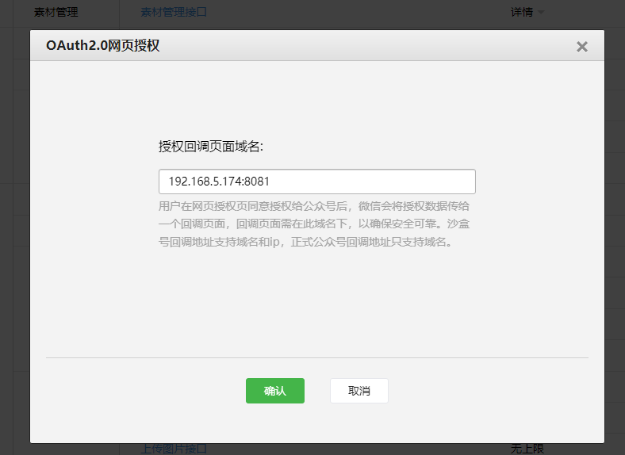

# 公众号网页授权

[网页授权 | 微信开放文档 (qq.com)](https://onedrive.live.com/view.aspx?resid=DF7A4B3EC4BD43F6%21258&id=documents&wd=target%28%E5%BE%AE%E4%BF%A1%E5%BC%80%E5%8F%91.one%7C9A91F7D1-3455-4C2A-8E52-D4029E31CB09%2F%E5%BE%AE%E4%BF%A1%E5%85%AC%E4%BC%97%E5%8F%B7%E7%BD%91%E9%A1%B5%E5%BC%80%E5%8F%91%7C1EC7BF73-BF46-4D56-9D50-3EA45EC4C9C0%2F%29)

前端主要关注第一步：[用户同意授权，获取code](https://developers.weixin.qq.com/doc/offiaccount/OA_Web_Apps/Wechat_webpage_authorization.html#0)

测试号申请：[微信公众平台 (qq.com)](https://mp.weixin.qq.com/debug/cgi-bin/sandboxinfo?action=showinfo&t=sandbox/index)
在上面的 ​测试号管理​ 管理页面获取 appID和appsecret，用于拼接下面的引导用户授权的url，获取code；并提供给后端，用于后续步骤

```url
<https://open.weixin.qq.com/connect/oauth2/authorize?appid=wx79739b707c3ae3c3&redirect_uri=http://192.168.5.174:8081/login&response_type=code&scope=snsapi_userinfo#wechat_redirect>
```

同时需要在这个页面中的 ```网页授权获取用户基本信息```中，点击修改，在弹框中将上面的url中的redirect_uri中的192.168.5.174:8081填入

点击修改之后，将redirect_uri中的192.168.5.174:8081填入  ​授权回调页面域名​

